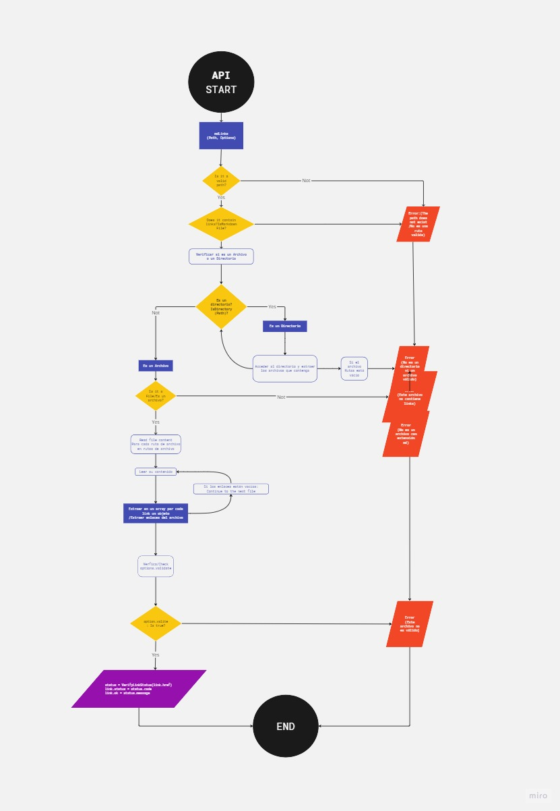
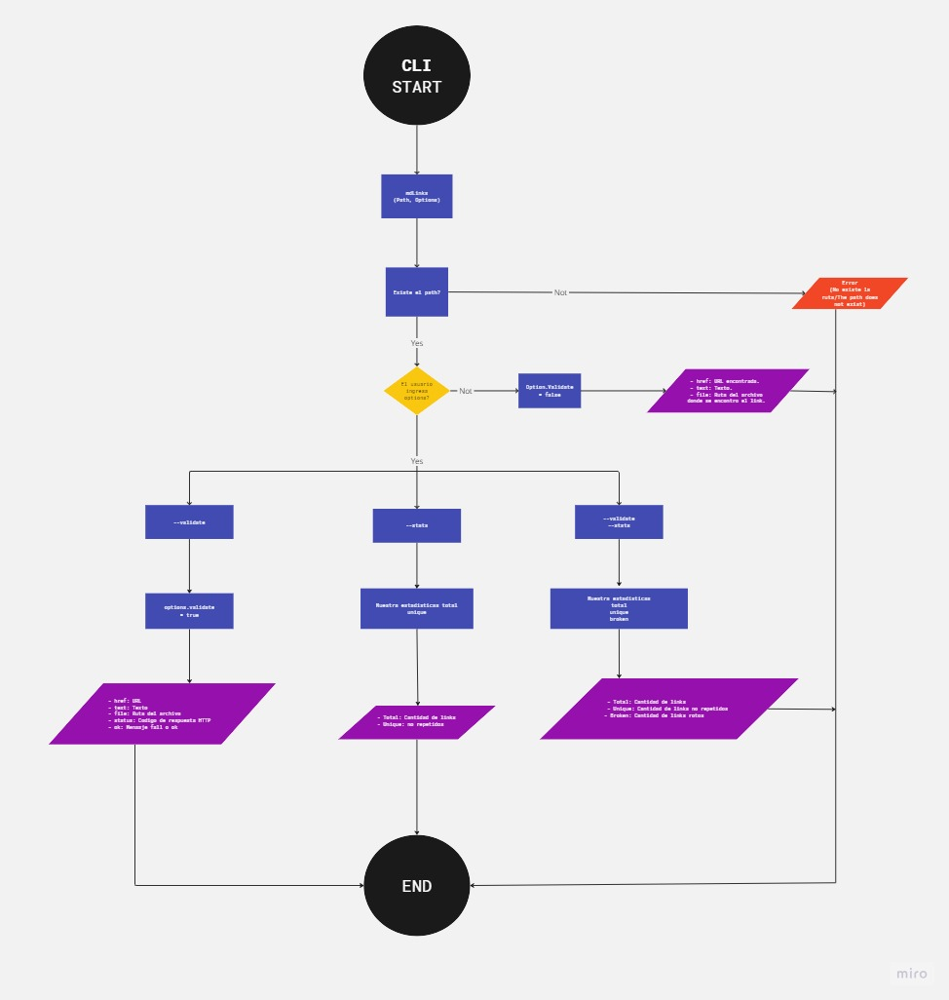

# Markdown Links

## Índice

* [1. Resumen del proyecto](#1-resumen-del-proyecto)
* [2. Diagrama de flujo](#2-diagrama-de-flujo)
* [3. Snippets de uso](#3-snippets-de-uso)

***

## 1. Resumen del proyecto

Esta libreria permite obtener enlaces contenidos en un archivo Markdown, donde se verifica el estado del link para ver sus estadisticas en cantidad de Links encontrados, Links rotos, Links unicos y Links internos.

## 2. Diagrama de flujo

'


## 3. Snippets de uso

Este es un paquete npm para extraer y analizar enlaces de archivos Markdown.

https://www.npmjs.com/package/md-links-samcaro

Este proyecto puede ser utilizado a través de la terminal CLI

Por ejemplo:

md-links <path-to-file> [options] Donde options puede ser 'validate' para verificar el estado del link y/o 'stats' para ver estádisticas del archivo(path) como cantidad de links encontrados, links rotos, etc

$ md-links example.md

```sh
href: http://algo.com/2/3/
text: Link a algo
file: ./some/example.md: - 3
```
```sh
href: https://otra-cosa.net/algun-doc.html
text: Link a otra cosa
file: ./some/example.md: - 12
```
```sh
href: http://google.com/
text: Google
file: ./some/example.md: - 15
Usando validate:
```
$ md-links example.md --validate

```sh
href: http://algo.com/2/3/
text: Link a algo
file: ./some/example.md: - 3
code: 200 - OK
```
```sh
href: https://otra-cosa.net/algun-doc.html
text: Link a otra cosa
file: ./some/example.md: - 12
code: 404 - FAIL
```
```sh
href: http://google.com/
text: Google
file: ./some/example.md: - 15
code: 203 - OK
Usando --stats
```

Total: 9, Unique: 3

Usando --validate y --stats (pueden usarse tanto juntos como separados)

Total: 9, Unique: 1, Broken: 0 